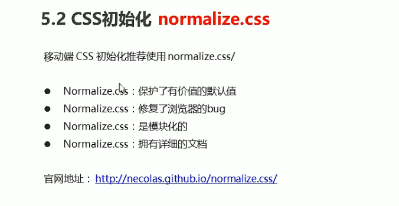
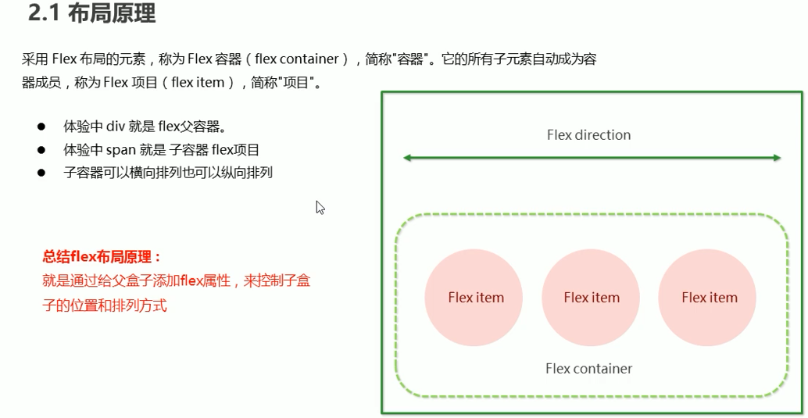

# 移动端开发

## 视口(viewport)

css样式初始化https://necolas.github.io/normalize.css/

swiper轮播图https://www.swiper.com.cn/

响应式框架https://getbootstrap.com/

布局视口 layout viewport：默认980px

视觉视口 visual viewport ：可以看到的范围

理想视口 ideal viewport：根据客户端自动调整

## 二倍图

当你用浏览器开发移动端时，有个物理像素比！

为什么要使用二倍图？视网膜屏幕硬件技术发展。

在移动端准备的图片分辨率。最好是需要格子的两倍大小，避免模糊现象。

可以直接使用工具切图，帮助我们切出多倍图来。

## 移动端主流方案

移动端初始化css样式

## 移动端技术选型

### 流式布局

京东移动端布局。主要用百分比做

### flex弹性布局

弹性子元素默认不换行

必须开启换行！flex-wrap

将主轴和换行一起写

### less+rem+媒体查询布局

多媒体查询

多层级的媒体查询建议从小到大的顺序来

针对不同的媒体使用不同的css样式

缺陷：

无逻辑代码！

#### 引入less超集！

less嵌套

less运算

适配

#### 优先级750px

less的样式复用，导入

## UI协作（插件）

蓝湖https://lanhuapp.com/

慕课https://www.mockplus.cn/

主流UI开发还是ps and ios-Sketch

前端不负责切图了~

必须确定前端适配方案！

### 响应式媒体查询

### 响应式bootstarp

官网：https://getbootstrap.com/docs/

父容器都是container

#### bootstrap栅格系统

**这里其实有问题。将容器内分成12份，也就是说，内部盒子都是百分比计算得到的宽度**

#### 嵌套技巧

#### 网格偏移

#### 网格排序

#### ★响应式工具(隐藏展示列)

**总结：**

**先从pc端开始做，然后一步步做到移动端，尽情利用bootstrap框架。**

### 混合技术开发

## 主流app开发

原生应用(native app)，

网页应用(web app，或HTML5 app)

混合模式移动应用(hybrid app)

三者区分：

**Web App**是生存在浏览器里的应用，所以只能运行在浏览器里，宿主是浏览器，不再是操作系统。资源一般都在网络上。说的根本点就是一个触屏版的网站。指基于Web的系统和应用，运行在高端手机的网络和浏览器上，用网页技术开发实现特定功能的应用，对手机性能要求比较高。

**Native App（原生开发）**:目前较为成熟，各大公司均采用此方式。但是其人工成本较高，同一个项目，至少需要Android端、iOS端、Web端三个开发团队。是一个原生程序，一般运行在机器操作系统上，有很强的交互，一般静态资源都是在本地的。浏览使用方便，体验度高。在实现上要么使用Objecttive-c和cocoaTouch Framework撰写iOS程序，要么选择java+Android Framework撰写android应用程序。

**Hybrid App（混合开发★）**，基于**webkit内核**的第三方跨平台移动应用引擎框架进行开发。使用HTML5和JS作为开发，调用引擎封装的底层功能如照相机、传感器、通讯录等。是一个半原生程序，伪造了一个浏览器的apk/ipa原生程序，把**IP地址**写死了，然后里面运行了一个webapp。里面是WebView UI 。但是还是运行在机器的操作系统上，交互较弱，资源一般在本地或者网络都可以。浏览体验度次之。

### 渲染引擎

毫无疑问，webview是Hybrid App开发的核心。webview可以简单的理解为一个浏览器。webview 使用的是手机自带的浏览器内核，一般来说，手机厂家在内置浏览器的时候都会对其内核做一定的修改，所以在webview渲染的内容可能或有些差异，但是这基本上不影响APP的开发。绝大部分手机都使用的是WebKit作为webview的渲染引擎。

### Facebook推荐的全新app开发方法

**React Native App**

Facebook发起的开源的一套新的APP开发方案,使用JS+部分原生语法来实现功能。初次学习成本较高,但是在入门后,经过良好的封装也能够实现大部分的跨平台。而且体验很好。

## 选择混合开发作为学习

## 移动app适配

移动端布局：flex布局

这里用了相对视口单位，更好适配移动端

★vh不太需要，常用vw替代vw。

## 打包工具webpack

## 

## angular、react还是vue？

## jQuery还有用

## swiper是个好东西

## 开发方式：

## Apache Cordova SDK开发

Apache Cordova是一个著名的跨平台应用程序开发框架，该框架使用Web技术，包括HTML，CSS和JavaScript。

使用Apache Cordova的一些企业是Walmart，Adobe，QrStore等。

**选择Cordova框架进行跨平台应用程序开发的主要原因：**

1. 可重用代码
2. 熟悉的技术
3. 强大的社区支持
4. 广泛的插件
5. 免费和开源
6. 离线开发
7. 调试
8. 实时重载

如今，Apache Apache Cordova云因其提供的丰富应用程序体验而被企业广泛使用。

## Flutter SDK开发

Flutter由Google开发，它是一个牛逼的开源平台，可用于跨平台应用程序开发。它具有吸引力的原因是：快速的开发，富有表现力的精美UI和类似本机的性能。

使用Flutter的一些公司是Google，eBay，宝马等。

**选择Flutter框架进行跨平台应用程序开发的主要原因：**

1. 高度稳定
2. DART，AOT编译语言
3. 平稳的开发周期
4. 强大的热加载功能
5. 满足各种需求的UI套件
6. 完美匹配的Flutter现在拥有200万用户，并且还在不断增加。

## Ionic SDK开发

Ionic是用于跨平台应用程序开发的增长最快且领先的开源框架。针对移动设备进行了优化的UI组件库和工具有助于快速构建交互式应用程序。
使用Ionic的企业包括GE，空中客车，Panera等。

**选择Ionic进行跨平台应用程序开发的主要原因：**

1. 开发人员友好
2. 庞大的社区
3. 角度优势
4. 一个代码即可
5. Cordova edge
6. 高标准的UI
7. 简化测试

根据一份报告，企业高管更喜欢Ionic和React Native等解决方案。

## React native

由Facebook在2015年开发的React Native可帮助企业使用Swift，Objective C和Java等语言构建类似于本机的应用程序。

使用React Native框架的一些企业是Facebook，Skype，Tesla等。

**选择React本机框架进行跨平台应用程序开发的主要原因：**

1. 现成的组件
2. 社区驱动
3. 热加载
4. 开源
5. React Native for Web功能
6. 高度可靠
7. 本地功能易于访问
8. 本机UI组件的实现

在过去的几年中，大多数公司都信任React Native满足混合应用程序的需求。

## NativeScript

NativeScript是具有活跃的开发人员社区的开源框架。开源框架用于使用Angular和Vue构建跨平台应用程序，以加快应用程序开发速度。

使用NativeScript框架的一些公司是GeekyAnts，Traverse LLC。，Workbox等。

**选择NativeScript框架进行跨平台应用程序开发的主要原因：**

1. 一个适用于iOS或Android的代码库。
2. 可重复使用的代码
3. 具有成本效益
4. 轻松访问应用程序
5. Angular，TypeScript或JavaScript的优势
6. 易于使用和良好的用户体验
7. 低代码开发
8. 减少维护

简单的Web技能和易于使用的工具使NativeScript成为当今大多数企业的不错选择。

## 等等其他的，之后会慢慢介绍

